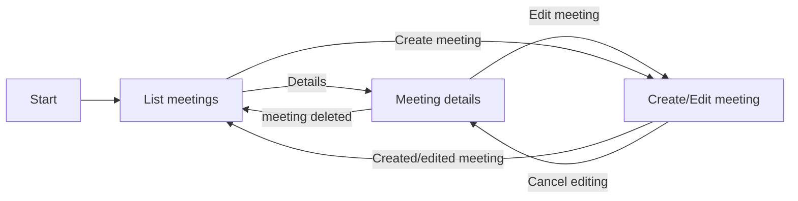

# Meetings app flow chart:

  

# Meetings app improvements

  

### Suporte para criação de contas

> Criação de contas para que usuários possam logar e gerenciar suas próprias reuniões.

### Infinite scroll

> Infinite scroll na tela de lista de reuniões.

### Máscaras e validações

> Máscaras nos campos de data e hora bem como validações de datas e horas apropriadas

  
### Upload de imagem

> Permitir que usuário faça upload de imagens para cadastrar na reunião